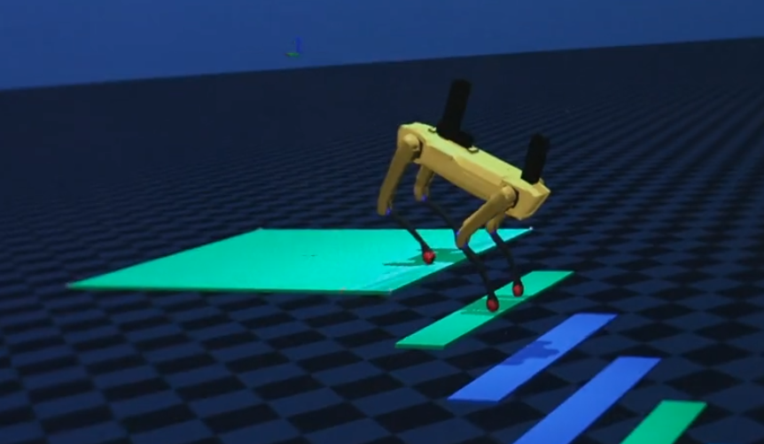

_[Boston Dynamics](https://bostondynamics.com/) is a robotics company that builds mobile and largely autonomous robots for a variety of applications, such as truck unloading and factory inspection._

For two summers, I interned with the simulation team in the Central Software department. In my first summer, I worked on tools for behavior tests in simulation. In my second summer, I built a pipeline for synthetic data generation for ML. 

### Summer 2023: Simulation Test Infrastructure

In my first summer, I worked on infrastructure for running simulations to test robot behaviors, using the MuJoCo physics engine. I contributed to the C++ backend, and I developed a Python API that enables robotics engineers to specify robot actions and check whether the simulated behavior matches expectations. Additionally, I initiated and participated in an investigation of discrepancies between different physics engines.

For this project, I coordinated among multiple internal groups to determine requirements for the simulation testing API. I subsequently organized and documented the internal rollout of the testing infrastructure, and I helped train software engineers to use the API.

     

### Summer 2024: Synthetic Data Generation for Perception

In my second summer, I built a pipeline for synthetic data generation using Blender. Boston Dynamics' robots use machine learning for perception tasks, and these models require training data. I developed a tool that lets engineers generate synthetic data for training, instead of relying entirely on images from the actual robots. I built the pipeline from scratch, including functionality such as loading a scene, adding objects, randomizing the scene, stepping physics to ensure realism, and generating and saving photorealistic images. The pipeline uses Blender on the backend, but the API is almost entirely renderer-agnostic and can be used with other render engines.

     

