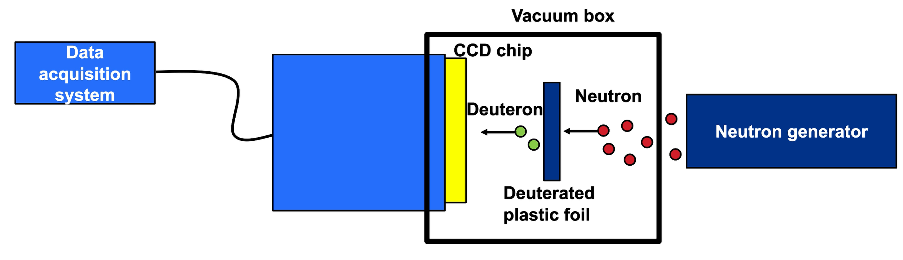
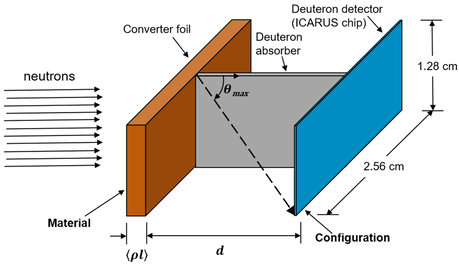

<i>The <a href="https://www.lle.rochester.edu/">Laboratory for Laser Energetics (LLE)</a> is a national lab-like facility at the University of Rochester that conducts experiments with high-powered lasers, with a focus on nuclear fusion.</i>

In this internship, I designed a neutron spectrometer for analyzing the temperature and yield of fusion reactions. I modeled the performance of the spectrometer using Monte Carlo N-Particle Code, then used MATLAB to analyze the simulated data. I was rehired for a second summer to assist with plans for fabricating a prototype of the detector. I also assisted in the presentation of a poster at the 2022 High-Temperature Plasma Diagnostics conference.

<a href='https://henry-berger.github.io/files/lle_report.pdf'>Download project report</a>

 
<em>Schematic of the spectrometer setup. The neutron generator would be an inertial confinement fusion (ICF) reaction.</em>

 
<em>Diagram of the spectrometer, with the design parameters I studied in bold.</em>

