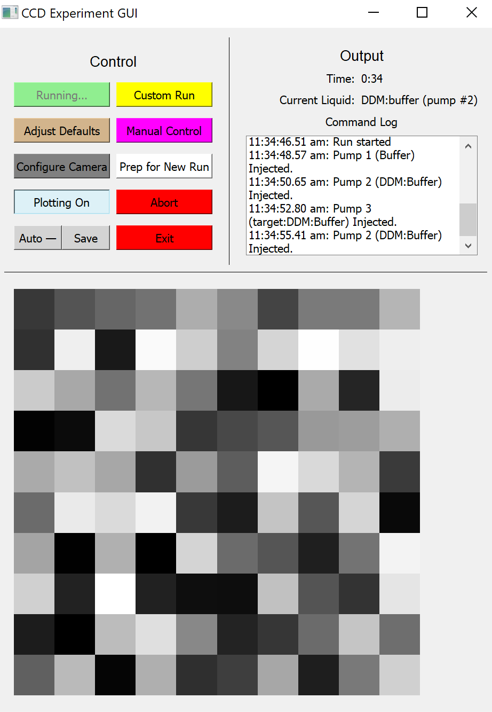

<i>The <a href="https://www.sas.rochester.edu/chm/groups/rothberg/">Rothberg group</a> is a lab within the Chemistry Department at the University of Rochester, led by Prof. Lewis Rothberg. The lab focuses on biomolecular sensing.</i>

I created GUIs to automate two experiments conducted by the Rothberg Lab. Both experiments use interferometry to detect trace amounts of substances, such as allergens in food or antibodies in blood. One experiment involved interfacing with an electrometer and a translation stage, and the other experiment involved interfacing with a CCD camera and three syringe pumps.

The GUIs, written in Python using PyQt5, allow the experimenter to set up an experiment and then run it without further human intervention. The experimenter can also view the data in real time and intervene to adjust the experiment, if necessary.

 
<em>Screenshot of the main window of the GUI during an experiment, including controls, a log, and real-time visualization. (This screenshot is from a test run, but if the experiment were actually running, the image would normally be a real-time visualization of the image from the CCD, not the randomly generated noise pictured here.)</em>

